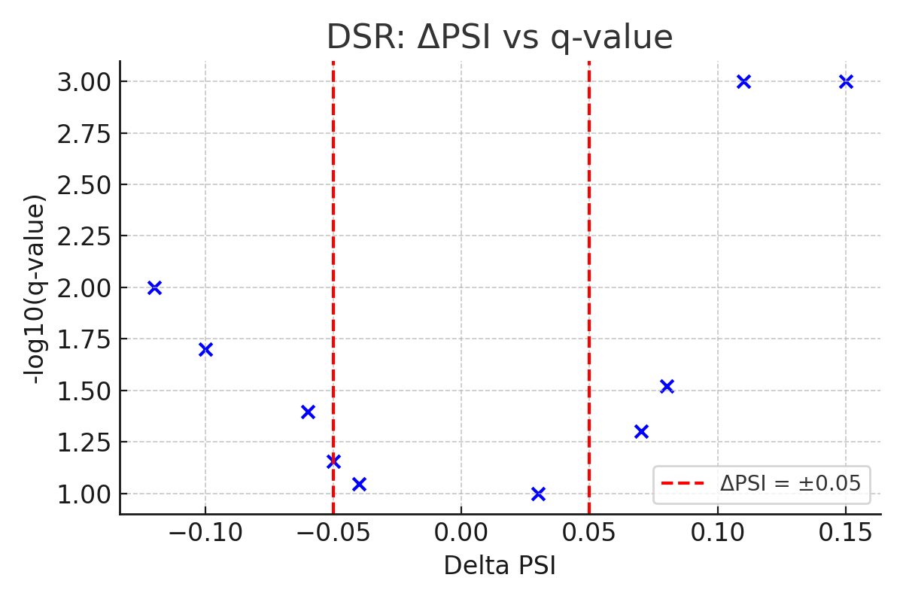
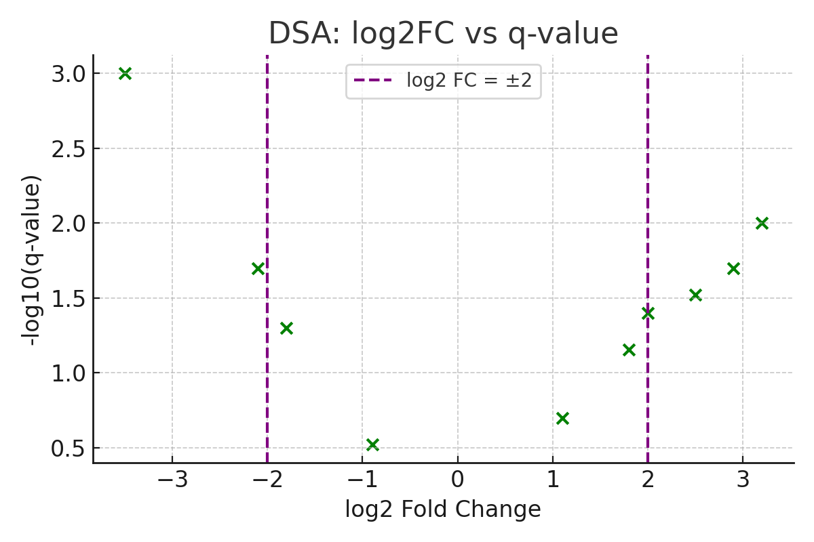

# MntJULiP Differential Splicing Analysis: Control vs Test

This README provides a comprehensive guide to interpreting, filtering, and visualizing intron-level differential splicing results from [MntJULiP](https://github.com/lingolab/MntJULiP), particularly for control vs. test conditions. It covers both DSR (Differential Splicing Ratio) and DSA (Differential Splicing Abundance) models.

---

## 📁 Output Files Overview

### 🧬 DSR (Differential Splicing Ratio)

- **diff_spliced_groups.txt** / **differential_spliced_groups.txt**  
  - Group ID
  - Coordinates
  - Strand
  - Gene name
  - Bunch type (`i` or `o`)
  - Log-likelihood ratio
  - p-value
  - q-value

- **diff_spliced_introns.txt** / **differential_spliced_introns.txt**  
  - Group ID
  - Intron coordinates
  - Strand
  - Gene name
  - PSI in control
  - PSI in test
  - ΔPSI (delta PSI)

### 🔬 DSA (Differential Splicing Abundance)

- **diff_introns.txt**  
  - Intron coordinates
  - Gene name
  - Test status
  - Log-likelihood
  - p-value (col 8)
  - q-value (col 9)
  - Avg read counts in control and test (cols 10 & 11)

---

## 🧪 Step-by-Step Filtering Instructions

### ✅ Step 1: Count Lines in Output

```bash
wc -l diff_spliced_groups.txt
wc -l diff_spliced_introns.txt
wc -l diff_introns.txt
wc -l intron_data.txt
wc -l group_data.txt
```

### ✅ Step 2: Filter DSR Introns (ΔPSI >= 0.05 and q-value ≤ 0.05)

Python script: `filterDSRIntrons.py`

```python
#!/usr/bin/env python3
import pandas as pd
import argparse

parser = argparse.ArgumentParser()
parser.add_argument('--intron', required=True, help='differential_spliced_introns.txt')
parser.add_argument('--group', required=True, help='differential_spliced_groups.txt')
parser.add_argument('--dpsi', type=float, default=0.05, help='Minimum |delta PSI| threshold')
parser.add_argument('--qvalue', type=float, default=0.05, help='Maximum q-value threshold')
args = parser.parse_args()

introns = pd.read_csv(args.intron, sep='\t')
groups = pd.read_csv(args.group, sep='\t')

significant_groups = groups[groups['q_value'] <= args.qvalue]
merged = introns.merge(significant_groups[['group_id', 'q_value']], on='group_id')
filtered = merged[merged['delta_psi'].abs() >= args.dpsi]

filtered.to_csv('filtered_DSR_introns.txt', sep='\t', index=False)
print(f"Filtered {len(filtered)} introns meeting criteria.")
```

Run with:

```bash
python3 filterDSRIntrons.py     --intron differential_spliced_introns.txt     --group differential_spliced_groups.txt     --dpsi 0.05     --qvalue 0.05
```

### ✅ Step 3: Filter DSA Introns (Fold Change ≥ 4 or ≤ 0.25 and p/q ≤ 0.05)

```bash
awk 'NR > 1 && $8 != "NA" && $8 <= 0.05 && (($10 > 0 && ($11/$10 >= 4 || $11/$10 <= 0.25)) || ($11 > 0 && ($10/$11 >= 4 || $10/$11 <= 0.25)))' diff_introns.txt > filtered_dsa_introns.txt
```

### ✅ Step 4: Count Filtered Introns and Unique Genes

```bash
# Count introns
wc -l filtered_DSR_introns.txt
wc -l filtered_dsa_introns.txt

# Count unique genes
cut -f6 filtered_DSR_introns.txt | sort | uniq | wc -l
cut -f6 filtered_dsa_introns.txt | sort | uniq | wc -l
```

---

## 📊 Visualization Examples

### DSR Plot – ΔPSI vs -log10(q-value)



### DSA Plot – log2 Fold Change vs -log10(q-value)



---

## 📚 Interpretation Notes

- **DSR** evaluates groups of introns sharing splice sites. Significance is at the **group level**.
- **DSA** evaluates each intron independently, considering read counts and PSI.
- **Filter thresholds** (e.g., ΔPSI ≥ 0.05, q ≤ 0.05, fold change ≥ 4) can be adjusted based on biological relevance.
- Use q-values for multiple-testing correction where available.

---

## 🧰 Requirements

- Python 3+
- pandas
- awk
- MntJULiP tools

---

## 📬 Contact / Support

For help with MntJULiP analysis, contact your bioinformatics support team or open an issue on the [GitHub repository](https://github.com/lingolab/MntJULiP).

---

© 2025 MntJULiP Analysis Toolkit
